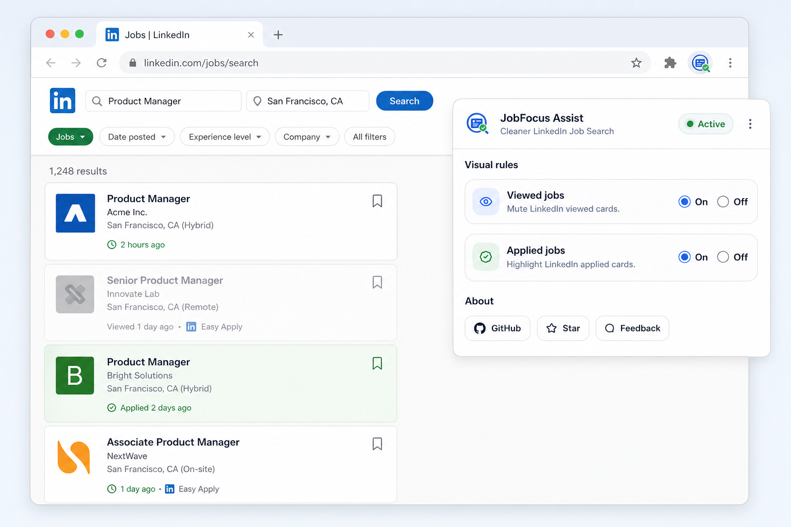

# JobFocus Assist

JobFocus Assist is a minimal Chrome extension that restyles LinkedIn job result cards based only on the state already visible in LinkedIn.

> *JobFocus Assist: LinkedIn Job Search Visual Helper*

## What it does

- Detects LinkedIn job cards
- Mutes cards marked `Viewed`
- Marks cards marked `Applied`
- Leaves all other cards unchanged
- Re-runs automatically as LinkedIn updates the job list

## Privacy

- No job data is stored
- No LinkedIn content is uploaded
- Only extension preferences are stored locally in Chrome storage

See the full policy in [docs/privacy-policy.md](docs/privacy-policy.md).

## Landing pages

- `landing/url-builder/` is a static, client-side LinkedIn Jobs URL builder.
- It builds public search URLs from keyword groups, exclusions, geoId, recency, and sort.
- It stores no search history, job data, or user behavior.

Open locally at `http://localhost:4173/landing/url-builder/` when serving this repo.

# Install

### install from Chrome Web Store

1. Open the [Chrome Web Store](https://chrome.google.com/webstore/category/extensions)
2. Search for "JobFocus Assist"
3. Click "Add to Chrome"

Direct link to the extension: [JobFocus Assist] ***Comming soon to the Chrome Web Store***

### install from here

0. Download the extension source code from this repository.
1. Open `chrome://extensions`
2. Enable Developer mode
3. Click Load unpacked
4. Select this folder

## Project links

- Repository: https://github.com/Ajandaghian/JobFocus_Assist
- Issues: https://github.com/Ajandaghian/JobFocus_Assist/issues
